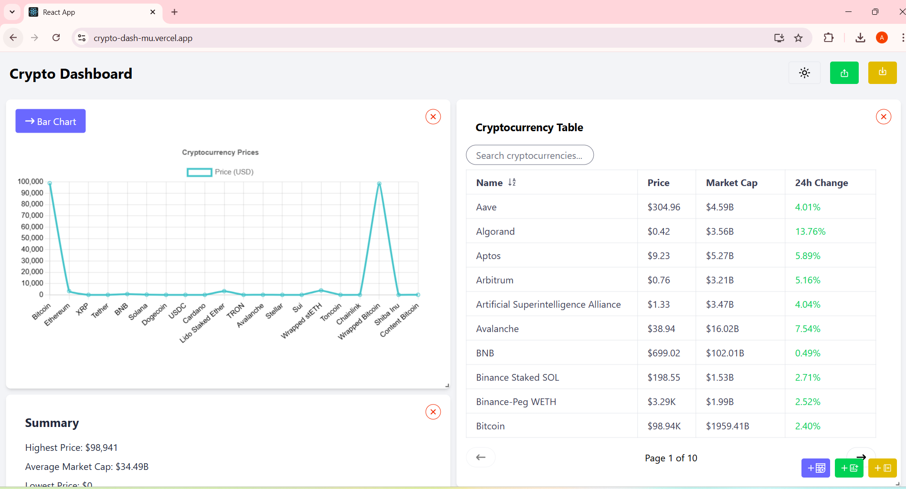
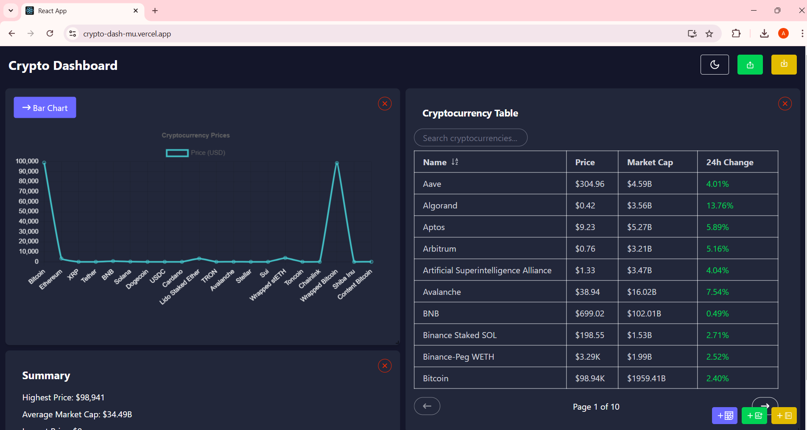

# Crypto Dashboard
[Live Demo](https://crypto-dash-mu.vercel.app/)

[Watch the demo video](https://www.loom.com/share/6cd25fa6350a4b19a1a2635cd0864afe?sid=34186754-b44b-4ceb-87ac-649a35e74e0f)




## Project Overview
A cryptocurrency dashboard built with React, Redux, and TypeScript. This application fetches cryptocurrency data from the CoinGecko API and displays it in a customizable dashboard. It allows users to toggle between dark and light modes, export and import dashboard configurations, and modify the layout of displayed components.

Note: Double Click and then hold on the component to drag and drop the component.

## Table of Contents

- [Setup Instructions](#setup-instructions)
- [Overview](#overview)
  - [Component Structure](#component-structure)
  - [State Management](#state-management)
  - [Data Handling](#data-handling)
  - [Layout Logic](#layout-logic)
- [Features](#features)
- [Limitations](#limitations)
- [Notable Decisions](#notable-decisions)


---

## Setup Instructions
### Prerequisites
Before you begin, make sure you have:

- Node.js (LTS version)
- npm 

1. Clone the repository:

    ```bash
    git clone https://github.com/ankitchouhan119/crypto-dash.git
    cd crypto-dash
    ```


2. Install dependencies:
    ```bash
    npm install
    ```

4. Start the Development Server
    ```bash
    npm start
    ```
    Open the app at `http://localhost:3000` in your browser.


---

## Technologies Used
- **React**
- **Tailwind CSS**
- **Redux Toolkit**
- **Axios**


---

## Overview
### Component Structure

    /
    ├── src/
    │   ├── components/ 
    │   │     ├── AddComponentButton.tsx                    
    │   │     ├── Dashboard.tsx                    
    │   │     ├── Graph.tsx                    
    │   │     ├── SummaryCard.tsx                    
    │   │     ├── Table.tsx                    
    │   ├── hooks/
    │   │     ├── useAppSelector.ts   
    │   ├── store/
    │   │     ├── cryptoSlice.ts            
    │   │     ├── layoutSlice.ts            
    │   │     ├── store.ts            
    │   │     ├── themeSlice.ts            
    │                  
    └── ...

### State Management
State management is handled using Redux Toolkit.
 - `cryptoSlice.ts`:  Stores cryptocurrency data and manages API request status ( `loading`, `succeeded`, `failed` ). It fetches data using `createAsyncThunk`.
 - `layoutSlice.ts`:  Manages the layout of components (position, size, etc.). It includes actions to add, update, or remove components in the dashboard layout.
 - `themeSlice.ts`:  Manages the dark/light theme state. It toggles the theme whenever the user interacts with the UI.

### Data Handling
The cryptocurrency data is fetched using Axios from the CoinGecko API. The app fetches data for cryptocurrency markets in USD. This data is managed by Redux as part of the cryptoSlice state.

- **Fetching Data**: The `createAsyncThunk` API from Redux Toolkit is used to manage asynchronous data fetching. The app makes a GET request to the CoinGecko API for cryptocurrency market data.
- **Error Handling**: When data fetching fails, the app manages errors using Redux's `rejected` state in the `cryptoSlice`.

### Layout Logic
The layout logic is managed through Redux state stored in `layoutSlice.ts`. Each component's position and size are stored as an array of layout objects (`LayoutItem`).

Users can add, remove, or update these components through actions such as `addComponent`, `removeComponent`, and `updateLayout`. The layout configuration is exported and imported as a JSON file for persistence.

## Features
- **Dark Mode / Light Mode**: Users can toggle between dark and light themes using a button in the navbar.
- **Export Dashboard Configuration**: Users can export the current layout configuration and theme settings into a JSON file.
- **Import Dashboard Configuration**: Users can import previously exported configuration JSON files to restore their layout and theme.
- **Dynamic Cryptocurrency Data**: The app fetches real-time data from the CoinGecko API and displays it for various cryptocurrencies.
- **Responsive Layout**: The layout of components can be customized, allowing users to rearrange widgets or cards within the dashboard.

## Limitations
- **Limited API Support**: Currently, only one API endpoint (for cryptocurrency markets) is supported.
- **Basic Error Handling**: There's minimal error handling for scenarios such as failed API requests or invalid configuration files during import.


## Notable Decisions
- **Redux Toolkit**: Used Redux Toolkit for state management due to its simplicity and built-in features like `createSlice` and `createAsyncThunk`. This reduces boilerplate and enhances developer productivity.
- **Component Layout Management**: Layout state is stored as an array of objects where each object represents a component's position and size. This allows for flexible and dynamic management of components.
- **Dark Mode**: The theme state is directly managed in Redux, allowing for centralized control of theme preferences.
- **JSON Export/Import**: Implemented file-based export/import functionality to persist layout and theme configurations. This enables users to share or restore their dashboard settings.


